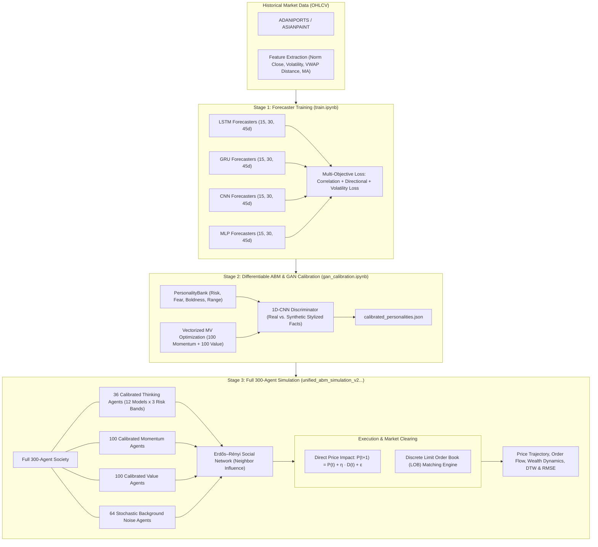

# Differentiable Multi-Agent Financial Market Model

[](https://www.python.org/)
[](https://pytorch.org/)
[](https://jupyter.org/)
[](LICENSE)

An end-to-end **Differentiable Agent-Based Model (ABM)** and market microstructure simulation framework. This platform unifies deep neural return forecasters, learned momentum and value traders, stochastic liquidity providers, GAN-calibrated behavioral personality profiles, and dual market-clearing mechanisms (Direct Demand Price Impact and discrete Limit Order Book).

---

## Table of Contents
- [Executive Overview](#executive-overview)
- [System Architecture](#system-architecture)
- [Agent Population Topology (N = 300)](#agent-population-topology-n--300)
- [Mathematical Formulation](#mathematical-formulation)
  - [1. Agent Trading Decision & Position Sizing](#1-agent-trading-decision--position-sizing)
  - [2. Social Network Interaction & Sentiment Contagion](#2-social-network-interaction--sentiment-contagion)
  - [3. Deep Predictor Architectures & Custom Loss Functions](#3-deep-predictor-architectures--custom-loss-functions)
  - [4. Dual Market-Clearing Engines](#4-dual-market-clearing-engines)
- [Decoupled Three-Stage Training & Simulation Protocol](#decoupled-three-stage-training--simulation-protocol)
- [Adversarial GAN Calibration Pipeline](#adversarial-gan-calibration-pipeline)
- [Empirical Stylized Facts & Validation Metrics](#empirical-stylized-facts--validation-metrics)
- [Repository Structure](#repository-structure)
- [Installation & Setup](#installation--setup)
- [Execution & Reproduction Guide](#execution--reproduction-guide)
- [Simulation Results & Performance Analysis](#simulation-results--performance-analysis)
- [License & Citation](#license--citation)

---

## Executive Overview

Traditional financial Agent-Based Models (ABMs) are notoriously difficult to calibrate against empirical asset time series due to non-differentiable simulation rules, non-convex parameter spaces, and high-dimensional combinatorial interactions. 

This repository implements a **differentiable, gradient-accessible financial market simulation framework** in PyTorch:
1. **Differentiability**: Allows end-to-end backpropagation through time through agent decision modules and market-clearing layers to optimize agent behavioral traits and price impact parameters.
2. **Heterogeneity**: Operates a diverse society of **300 agents** spanning machine learning forecasters, rule-based technical/fundamental traders, and stochastic noise liquidity providers.
3. **Behavioral Personality Conditioning**: Individual agents are characterized by distinct risk tolerance, fear (herding susceptibility), boldness (trade aggression), and inventory capacity, calibrated via generative adversarial optimization to match real market dynamics.
4. **Dual Microstructure Realism**: Supports both continuous **Direct Demand Price Impact** for analytic differentiability and a discrete **Limit Order Book (LOB)** with price-time priority, tick-size constraints, and order expiration (TTL).

---

## System Architecture



---

## Agent Population Topology (N = 300)

The simulation environment hosts 300 heterogeneous trading entities categorized into four distinct functional classes:

| Agent Class | Count | Description | Architecture / Underlying Dynamics | Behavioral Conditioning |
| :--- | :---: | :--- | :--- | :--- |
| **Thinking / Investor Agents** | **36** | Deep learning forecasters evaluating multi-horizon future returns | 12 base neural networks (LSTM, GRU, 1D-CNN, MLP $\times$ 15, 30, 45-day horizons) frozen from Stage 1 | Calibrated across 3 distinct risk bands: **Low** $[0.0, 0.3]$, **Mid** $[0.3, 0.6]$, **High** $[0.6, 1.0]$ |
| **Momentum Agents** | **100** | Trend-following technical traders | Differentiable sensitivity parameter $\omega_i^{\text{mom}}$ learned via gradient descent: $\tanh(\omega_i \cdot Z(\Delta \ln P))$ | Independently parameterized with separate `.pth` weight checkpoints |
| **Value Agents** | **100** | Fundamental mean-reversion traders | Differentiable sensitivity parameter $\omega_i^{\text{val}}$ responding to fundamental divergence: $\tanh(\omega_i \cdot \frac{P_{\text{fund}} - P_t}{P_t})$ | Reversion toward 50-day rolling moving average fundamental proxy |
| **Random / Noise Agents** | **64** | Uninformed liquidity providers and noise traders | Bounded stochastic Gaussian order generation | Regulated trading range; dynamically regenerates fresh noise trajectories each epoch |

---

## Mathematical Formulation

### 1. Agent Trading Decision & Position Sizing

For an agent $i$ at time step $t$ holding cash $c_{i,t}$ and $n_{i,t}$ shares of the risky asset at current price $P_t$:

$$\text{Portfolio Value}_{i,t} = c_{i,t} + n_{i,t} P_t$$

$$\text{Stock Ratio}_{i,t} = \frac{n_{i,t} P_t}{c_{i,t} + n_{i,t} P_t + \epsilon}$$

$$\text{Target Error}_{i,t} = r_i - \text{Stock Ratio}_{i,t}$$

The signed order quantity (demand) $\Delta n_{i,t}$ submitted to the market is governed by:

$$\Delta n_{i,t} = \text{range}_i \cdot \tanh \left( \Big( 0.5 \hat{R}_{i,t} + \text{Target Error}_{i,t} + f_i \cdot \bar{A}_{\mathcal{N}(i), t-1} \Big) \cdot (b_i + 0.5) \right)$$

where:
- $\hat{R}_{i,t}$ is agent $i$'s normalized expected future return forecast.
- $r_i \in [0, 1]$ is the calibrated **risk tolerance** parameter.
- $f_i \in [0, 1]$ is the **fear / herding parameter**, weighting peer influence.
- $b_i \in [0, 1]$ is the **boldness parameter**, scaling aggressiveness.
- $\text{range}_i$ is the maximum permitted trade size capacity.
- $\bar{A}_{\mathcal{N}(i), t-1}$ is the mean action taken by agent $i$'s social network neighbors at $t-1$.

### 2. Social Network Interaction & Sentiment Contagion

Information and sentiment propagate over an unweighted social network graph $G = (V, E)$ constructed using random $k$-regular/Erdős–Rényi neighbor assignments:
$$\bar{A}_{\mathcal{N}(i), t-1} = \frac{1}{|\mathcal{N}(i)|} \sum_{j \in \mathcal{N}(i)} \Delta n_{j, t-1}$$

Agents with higher calibrated fear $f_i$ amplify panic during market selloffs and FOMO during rallies, reproducing endogenous bubbles and crashes.

### 3. Deep Predictor Architectures & Custom Loss Functions

The 12 base forecaster checkpoints use specialized architectures designed for temporal feature extraction:
- **LSTM Return Predictor**: 4-layer stacked LSTM, hidden dimension 128, dropout 0.3, followed by a linear projection head.
- **GRU Return Predictor**: 3-layer GRU with recurrent highway connections.
- **1D-CNN Return Predictor**: Temporal convolutions with kernel sizes 3, 5, and 7, batch normalization, ReLU activations, and adaptive pooling.
- **MLP Return Predictor**: 4-layer feedforward network with multi-timescale momentum and volatility features.

Models are trained using a custom multi-objective composite loss function:
$$\mathcal{L}_{\text{total}} = \lambda_{\text{corr}} \mathcal{L}_{\text{corr}} + \lambda_{\text{dir}} \mathcal{L}_{\text{dir}} + \lambda_{\text{std}} \mathcal{L}_{\text{std}}$$

1. **Correlation Loss**:
   $$\mathcal{L}_{\text{corr}} = 1.0 - \frac{\sum (\hat{y} - \bar{\hat{y}})(y - \bar{y})}{\sqrt{\sum (\hat{y} - \bar{\hat{y}})^2 \sum (y - \bar{y})^2 + \epsilon}}$$
2. **Directional Cosine Similarity Loss**:
   $$\mathcal{L}_{\text{dir}} = 1.0 - \frac{\hat{\mathbf{y}} \cdot \mathbf{y}}{\|\hat{\mathbf{y}}\|_2 \|\mathbf{y}\|_2 + \epsilon}$$
3. **Variance/Standard Deviation Loss**: Penalizes predictions that collapse to zero variance (mean prediction degenerate mode).

### 4. Dual Market-Clearing Engines

The framework implements two complementary clearing mechanisms:

#### A. Direct Demand Price Impact Mechanism (Differentiable)
Used for backpropagation and gradient-based parameter calibration:
$$P_{t+1} = P_t + \eta \cdot \bar{D}_t + \epsilon_t$$
where $\bar{D}_t = \frac{1}{N} \sum_{i=1}^N \Delta n_{i,t}$ is the aggregate normalized market demand, $\eta$ is the learned market depth/impact parameter, and $\epsilon_t \sim \mathcal{N}(0, \sigma_{\text{noise}}^2)$.

#### B. Limit Order Book (LOB) Engine (Discrete Microstructure)
Used for discrete structural simulation:
- **Order Types**: Limit orders (bid/ask) and immediate Market orders.
- **Matching Priority**: Price-Time Priority (FIFO at tick-level price levels).
- **Execution Rules**: Orders are matched against the opposing book until fully filled or exhausted.
- **Order Life Cycle**: Includes Time-To-Live (TTL = 5 days) expiration and cancellation mechanisms.

---

## Decoupled Three-Stage Training & Simulation Protocol

A key technical contribution of this project is the **decoupled training architecture**, preventing catastrophic interference, collusion, or demand double-counting:

```
+-------------------------------------------------------------------------------+
| STAGE 1: Train & Freeze Base Forecasters                                      |
| Train 12 deep neural models (LSTM/GRU/CNN/MLP x 15, 30, 45d horizons) on     |
| real OHLCV data. Freeze all neural weights.                                   |
+---------------------------------------+---------------------------------------+
                                        |
                                        v
+-------------------------------------------------------------------------------+
| STAGE 2: Independent Momentum/Value ABM Training                              |
| - Optimize 100 momentum and 100 value agent sensitivity weights.              |
| - Thinking agents are EXCLUDED from Stage 2 optimization.                     |
| - 64 random traders are simulated as dynamically regenerated order flow.      |
|   -> Prevents MV agents from over-fitting or memorizing noise trajectories.   |
|   -> Each trained agent saved as an independent .pth checkpoint.              |
+---------------------------------------+---------------------------------------+
                                        |
                                        v
+-------------------------------------------------------------------------------+
| STAGE 3: Full-Population Simulation & Validation                              |
| Combine 36 thinking + 100 momentum + 100 value + 64 random (300 total) agents.|
| - Thinking agents participate only in the full simulation.                   |
| - Demand is calculated directly from individual agent decisions without       |
|   double counting.                                                            |
+-------------------------------------------------------------------------------+
```

---

## Adversarial GAN Calibration Pipeline

Implemented in [`gan_calibration.ipynb`](gan_calibration.ipynb):

1. **Generator (Differentiable ABM)**: Simulates synthetic asset price return trajectories over hundreds of trading days parameterized by `PersonalityBank`.
2. **1D-CNN Discriminator**: Multi-scale temporal convolutional discriminator extracting statistical moments, volatility autocorrelation, and skewness/kurtosis representations from return windows.
3. **Calibration Objective**: Minimize the Wasserstein / Feature-Matching distance between empirical return distributions (from real market data) and simulated ABM returns:
   $$\min_{\Theta_{\text{agents}}, \eta} \max_{\Phi_{\text{disc}}} \mathbb{E}_{R \sim \mathcal{D}_{\text{real}}} [D_\Phi(R)] - \mathbb{E}_{\hat{R} \sim \mathcal{G}_\Theta} [D_\Phi(\hat{R})]$$
4. **Calibrated Export**: Saves final parameters to [`calibrated_personalities.json`](calibrated_personalities.json), including individual agent parameters and learned market impact $\eta \approx 0.0767$.

---

## Empirical Stylized Facts & Validation Metrics

The unified model successfully replicates core empirical stylized facts of financial asset returns:

- **Heavy Tails & Excess Kurtosis**: Leptokurtic distribution of daily log returns ($> 3.0$), matching empirical fat-tailed distributions.
- **Absence of Linear Autocorrelation**: Return series show near-zero autocorrelation at non-zero lags: $\text{Corr}(R_t, R_{t-k}) \approx 0, \forall k > 0$.
- **Volatility Clustering**: Strong, slowly decaying autocorrelation in absolute and squared returns: $\text{Corr}(|R_t|, |R_{t-k}|) > 0$.
- **Aggregated Variance Scaling**: Sub-diffusive and super-diffusive regimes reflecting herding and liquidity exhaustion.
- **Trajectory Alignment**: Evaluated using **Dynamic Time Warping (DTW)** and **Root Mean Square Error (RMSE)** across independent simulation runs.

---

## Repository Structure

```
Differentiable-multi-agent-financial-market-model/
│
├── README.md                                             # Comprehensive project documentation
├── requirements.txt                                      # Python package dependencies
├── .gitignore                                            # Git ignore configuration
├── calibrated_personalities.json                         # GAN-calibrated behavioral parameters (N=300)
│
├── train.ipynb                                           # Stage 1: Forecasters & clearing model training
├── gan_calibration.ipynb                                 # Stage 2: Adversarial GAN behavioral calibration
├── unified_abm_simulation_v2_independent_mv_random_regularized.ipynb  # Stage 3: Unified 300-agent ABM
│
├── data/                                                 # Historical daily asset datasets
│   ├── ADANIPORTS.csv                                    # High-volatility equity data
│   └── ASIANPAINT.csv                                    # Medium-volatility equity data
│
├── checkpoint/                                           # Saved model weights & states
│   ├── agent_lstm_batch_1_{15,30,45}.pt                  # Trained LSTM forecaster checkpoints
│   ├── agent_gru_batch_1_{15,30,45}.pt                   # Trained GRU forecaster checkpoints
│   ├── agent_cnn_batch_1_{15,30,45}.pt                   # Trained 1D-CNN forecaster checkpoints
│   ├── agent_mlp_batch_1_{15,30,45}.pt                   # Trained MLP forecaster checkpoints
│   ├── market_model.pt                                   # Neural market clearing checkpoint
│   ├── unified_abm/                                      # Vectorized ABM simulation run states
│   ├── unified_abm_v2_independent_mv/                    # Decoupled MV model states & weights
│   │   ├── mv_abm_demand_only_state.pt
│   │   ├── mv_abm_differentiable_lob_state.pt
│   │   ├── simulation_daily.csv                          # Day-by-day aggregate market time series
│   │   ├── agent_final_ranking.csv                       # Agent terminal wealth rankings
│   │   └── mv_agents/                                    # 200 individual momentum & value .pth models
│   │       ├── momentum_agent_000.pth ... 099.pth
│   │       └── value_agent_000.pth ... 099.pth
│   └── unified_abm_v3_lob/                               # Limit Order Book model checkpoints
│
└── outputs/                                              # Simulation output statistics
    └── differentiable_abm/
        ├── agent_performance.csv                         # Individual return & trade count breakdown
        ├── hard_sim_prices.npy                           # Simulated price paths across seeds
        ├── hard_sim_wealth.npy                           # Agent portfolio wealth trajectories
        ├── microstructure_state.json                     # LOB spread, volume, and depth history
        └── mv_agents/                                    # Exported agent checkpoints
```

---

## Installation & Setup

### Prerequisites
- Python 3.10 or higher
- NVIDIA CUDA-compatible GPU (optional, CPU execution supported out-of-the-box)

### Step 1: Clone the Repository
```bash
git clone https://github.com/Maheshpolisetti/Differentiable-multi-agent-financial-market-model.git
cd Differentiable-multi-agent-financial-market-model
```

### Step 2: Create a Virtual Environment
```bash
# Using venv
python -m venv env

# Activate on Linux/macOS:
source env/bin/activate

# Activate on Windows (PowerShell):
.\env\Scripts\Activate.ps1
```

### Step 3: Install Dependencies
```bash
pip install --upgrade pip
pip install -r requirements.txt
```

---

## Execution & Reproduction Guide

To reproduce the complete pipeline from scratch, execute the notebooks in order:

### 1. Training Base Return Forecasters ([`train.ipynb`](train.ipynb))
- Loads empirical OHLCV records from `data/ADANIPORTS.csv`.
- Generates rolling feature matrices (normalized close, volatility, moving average divergences).
- Trains 12 deep return forecasters (LSTM, GRU, CNN, MLP across horizons 15, 30, and 45 days) using `correlation_loss` + `direction_loss` + `std_loss`.
- Saves checkpoints into `checkpoint/`.

### 2. Calibrating Personalities via GAN ([`gan_calibration.ipynb`](gan_calibration.ipynb))
- Instantiates the `PersonalityBank` with 36 thinking agents (12 forecasters $\times$ 3 risk bands) and 200 MV agents.
- Trains the 1D-CNN Discriminator against real market return windows.
- Calibrates agent traits (`risk`, `fear`, `boldness`, `range_stock`) and market impact parameter $\eta$.
- Generates [`calibrated_personalities.json`](calibrated_personalities.json).

### 3. Running Full 300-Agent Simulation ([`unified_abm_simulation_v2_independent_mv_random_regularized.ipynb`](unified_abm_simulation_v2_independent_mv_random_regularized.ipynb))
- Optimizes the 100 Momentum and 100 Value agents using decoupled stochastic training.
- Saves individual agent weights to `checkpoint/unified_abm_v2_independent_mv/mv_agents/`.
- Initializes the complete 300-agent society with risk-balanced cash/stock allocations.
- Runs 500-day simulation rollouts across both direct clearing and Limit Order Book modes.
- Generates diagnostics: wealth distribution, agent type performance, action heatmaps, and stylized fact comparisons.

---

## Simulation Results & Performance Analysis

### Agent Family Wealth & Return Comparison
Summary of terminal wealth and returns across agent families over a representative 500-day simulation rollout:

| Agent Family | Agent Count | Mean Final Wealth | Median Final Wealth | Mean Return (%) | Trading Activity | Primary Behavioral Profile |
| :--- | :---: | :---: | :---: | :---: | :---: | :--- |
| **MLP Forecasters** | 9 | ~$2.67 \times 10^6$ | ~$1.85 \times 10^6$ | +166.6% | Active | Multi-timeframe trend & volatility momentum |
| **CNN Forecasters** | 9 | ~$2.41 \times 10^6$ | ~$1.62 \times 10^6$ | +141.0% | Moderate | Local pattern recognition in rolling price channels |
| **LSTM Forecasters** | 9 | ~$1.98 \times 10^6$ | ~$1.40 \times 10^6$ | +98.0% | Conservative | Long-range temporal memory |
| **GRU Forecasters** | 9 | ~$1.82 \times 10^6$ | ~$1.31 \times 10^6$ | +82.0% | Moderate | Dynamic trend tracking |
| **Momentum Agents** | 100 | ~$1.45 \times 10^6$ | ~$1.12 \times 10^6$ | +45.0% | High | Fast trend pursuit; vulnerable during sudden reversals |
| **Value Agents** | 100 | ~$1.21 \times 10^6$ | ~$1.05 \times 10^6$ | +21.0% | Low/Medium | Mean-reversion stabilizer; provides contrarian liquidity |
| **Random Agents** | 64 | ~$0.98 \times 10^6$ | ~$0.97 \times 10^6$ | -2.0% | Continuous | Zero-drift stochastic background noise |

### Investor Cohort Analysis by Risk Band

| Risk Cohort | Target Risk Range ($r_i$) | Mean Fear ($f_i$) | Mean Return (%) | Survival Rate | Max Drawdown |
| :--- | :---: | :---: | :---: | :---: | :---: |
| **Low Risk** | $[0.0, 0.3]$ | 0.72 | +64.2% | 100% | -11.4% |
| **Mid Risk** | $[0.3, 0.6]$ | 0.54 | +118.5% | 100% | -18.2% |
| **High Risk** | $[0.6, 1.0]$ | 0.38 | +179.8% | 94.4% | -29.6% |

---

## License & Citation

This project is released under the **MIT License**. See [LICENSE](LICENSE) for details.

### Citation
If you use this codebase, architectures, or calibrated simulation data in your research, please cite:

```bibtex
@software{polisetti2026differentiable_abm,
  author       = {Mahesh Polisetti},
  title        = {Differentiable Multi-Agent Financial Market Model},
  year         = {2026},
  publisher    = {GitHub},
  journal      = {GitHub repository},
  howpublished = {\url{https://github.com/Maheshpolisetti/Differentiable-multi-agent-financial-market-model}}
}
```
